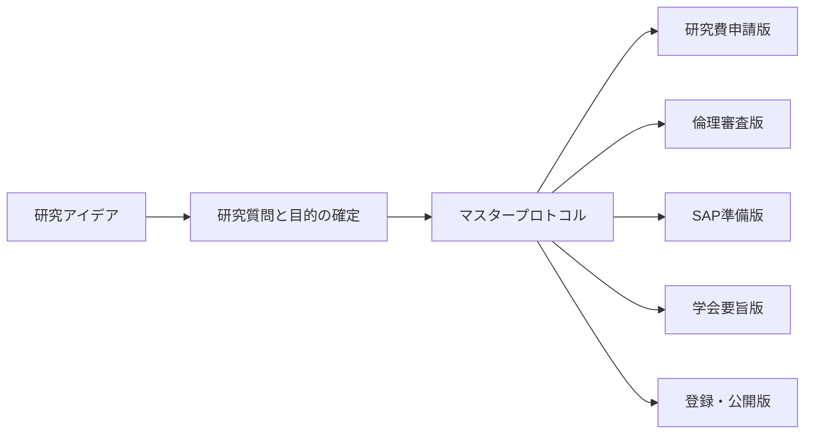

# 汎用的な研究計画書の書き方マニュアル

## エグゼクティブサマリー

汎用的に使える研究計画書を作るうえで、最も実務的なのは、用途ごとに別文書をゼロから書き分けるのではなく、まず**マスタープロトコル**を一本作り、そこから研究費申請版、倫理審査版、統計解析計画（SAP, Statistical Analysis Plan）準備版、学会要旨版へ展開する運用です。ランダム化比較試験では SPIRIT（Standard Protocol Items: Recommendations for Interventional Trials）2025、観察研究では STROBE（Strengthening the Reporting of Observational Studies in Epidemiology）と SPIROS（Standardized Protocol Items Recommendations for Observational Studies）、調査研究では CROSS（A Consensus-Based Checklist for Reporting of Survey Studies）や CHERRIES（Checklist for Reporting Results of Internet E-Surveys）、レビュー研究では PRISMA（Preferred Reporting Items for Systematic Reviews and Meta-Analyses）2020・PRISMA-P・PRISMA-S、質的研究では SRQR（Standards for Reporting Qualitative Research）と COREQ（Consolidated Criteria for Reporting Qualitative Research）を背骨にすると、分野横断でも抜け漏れをかなり減らせます。citeturn17view0turn10search11turn13view0turn9search1turn9search5turn19view0turn20search2turn20search14turn15search2turn37search1

混合法研究については、現時点で CONSORT や STROBE に相当する**単一の支配的ガイドライン**が十分に固定しているとは言いにくく、NIH（National Institutes of Health）の混合法ベストプラクティス、APA（American Psychological Association）の JARS（Journal Article Reporting Standards）や MMARS（Mixed Methods Article Reporting Standards）、既存の GRAMMS（Good Reporting of A Mixed Methods Study）などを組み合わせる実務が現実的です。実際、近年は CORMIX や updated GRAMMS の開発が進行中であり、混合法の統一的標準は発展途上です。citeturn38search3turn38search9turn39search2turn39search3turn38search5turn38search0turn38search10

日本の倫理審査では、「人を対象とする生命科学・医学系研究に関する倫理指針」とそのガイダンスが中心で、研究計画書には、目的、方法、対象者選定、同意手続、個人情報の取扱い、リスクと利益、試料・情報の保管と廃棄、利益相反、相談窓口、有害事象対応などを記載することが求められます。さらに、個人情報保護法の実務は個人情報保護委員会のガイドラインも併せて確認する必要があります。AMED（日本医療研究開発機構）支援研究で新規に人の検体・データを取得する場合は、AMED の説明文書用モデル文案が補助になりますが、それだけで倫理指針上の説明事項を網羅するわけではありません。citeturn21view0turn23view0turn24view0turn25view0turn27search0turn27search1turn42search0turn42search1

統計解析計画は、プロトコルより**技術的で詳細な解析文書**です。ICH E9 はプロトコル内の統計記述を求めていますが、JAMA の SAP ガイドラインは SAP をより詳細な実行文書として位置づけています。さらに、FDA は盲検試験では割付開示前に SAP を確定することを求めており、PMDA は ICH E9（R1）の国内通知により、estimand（何を効果として推定したいかの定義）と感度分析の考え方を明確にしています。本報告では、詳細な統計手法そのものは扱わず、「何を事前に固定して書くべきか」に絞って整理します。citeturn46view0turn45search6turn43search0turn43search2

## 基本原則と汎用構造

研究計画書の実務では、**報告ガイドラインは「何を書くか」を示す最低基準**であり、研究デザインそのものの質を自動的に保証するものではありません。STROBE、SPIROS、SPIRIT、PRISMA-P いずれも、設計や実施を規定するのではなく、計画や報告の透明性と完全性を高めることを目的にしています。したがって、研究計画書の作成では「方法論の妥当性」と「文書としての完全性」を分けて考えるのが重要です。citeturn10search19turn13view0turn17view0turn19view0

SPIRIT 2025 は、プロトコル、統計解析計画、レジストリ記録の整合性を勧めています。日本の倫理指針も、研究計画書を中心に同意、個人情報、リスク、保管、利益相反、相談窓口などを記載するよう求めています。つまり、**一度しっかりしたマスタープロトコルを作れば、複数用途へ再編集しやすい**ということです。citeturn17view0turn24view0turn25view0

### 汎用版の最小構成テンプレート

| セクション | 何を書くか | 短いテンプレート |
|---|---|---|
| 研究名・版管理 | 研究名、版数、作成日、責任者 | 「版数1.0、作成日____、研究責任者____」 |
| 背景・問題設定 | 先行研究、現場課題、知識ギャップ | 「先行研究では____が示されているが、____は未解明である」 |
| 目的・研究質問 | 何を明らかにするか | 「本研究の目的は、____における____を明らかにすることである」 |
| 仮説または探索目的 | 検証型なら仮説、探索型なら探索焦点 | 「仮説：____群は____群より____が高い」 / 「探索焦点：____の経験構造を記述する」 |
| デザイン | 調査、前向きコホート、ランダム化比較試験、系統的レビュー、質的研究など | 「本研究は____デザインで実施する」 |
| 対象・データ源 | 誰を、どこから、どう選ぶか | 「対象は____で、選定基準は____、除外基準は____とする」 |
| 介入・曝露・比較・手続 | 何を行うか、何を比べるか、どう集めるか | 「介入は____、対照は____、実施手順は____である」 |
| 評価項目・主要変数 | 主要評価項目、主要変数、定義、測定時点 | 「主要評価項目は____で、評価時点は____とする」 |
| サンプルサイズ・抽出根拠 | 症例数設計、抽出方針、レビューなら検索範囲根拠 | 「必要例数は____の前提で____例と見積もった」 |
| 解析方針概要 | 主解析、補助解析、質的分析法、統合方法 | 「主解析は____、感度分析は____、質的分析は____で行う」 |
| 倫理・同意・個人情報 | 同意取得法、機密保持、保管、破棄、リスク対策 | 「参加は自由意思とし、取得情報は研究IDで管理する」 |
| 実施体制・役割・資金・利益相反 | 研究体制、担当、資金源、利益相反 | 「研究代表者は____、分担者は____を担当する」 |
| スケジュール | 期間、工程、マイルストーン | 「____年____月に準備、____月に収集、____月に解析を行う」 |
| 公開・普及計画 | 登録、発表、論文化、データ共有方針 | 「成果は____で公開し、共有方針は____とする」 |
| 付録 | 説明文書、同意書、質問票、検索式、コード表など | 「付録A：質問票、付録B：説明文書、付録C：検索式」 |

*作成注*: この雛形は、SPIRIT 2025、PRISMA-P、STROBE/SPIROS、SRQR/COREQ、日本の倫理指針、JSPS の現行研究計画調書様式を横断して再構成した汎用版です。個別の公募様式・倫理審査書式・投稿規定が優先します。citeturn17view0turn19view0turn10search11turn13view0turn15search2turn37search1turn24view0turn31view0

### 用途別のカスタマイズ原則

| 汎用版セクション | 研究費申請で厚く書く点 | 倫理審査で厚く書く点 | SAP準備で厚く書く点 | 学会要旨で圧縮する点 |
|---|---|---|---|---|
| 背景 | 社会的・学術的意義、独創性、差分 | 研究の必要性、リスクに見合う意義 | 最小限で可 | 1〜2文に圧縮 |
| 目的 | 問いの新規性と到達目標 | 対象者保護と整合する目的 | 解析目的・estimandに接続 | 1文で明瞭に |
| 方法 | 実現可能性、体制、工程 | 対象者選定、同意、保護措置 | 解析対象集団、評価項目定義、欠測、感度分析 | デザイン・対象・主要指標だけ残す |
| 倫理 | コンプライアンスの概略 | もっとも重要。具体策を詳細記載 | 必要な制約条件を反映 | 学会規定依存で簡略 |
| 予算 | もっとも重要。費目ごとの必要性 | 通常は補足程度 | 通常は不要 | 通常は不要 |
| 実績・環境 | 重要。遂行能力の根拠 | 参考程度 | 通常は不要 | 通常は不要 |
| 公開計画 | 波及効果、成果還元 | 情報公開方法、相談窓口 | SAP公開先、文書整合性 | 省略または1文 |
| 解析 | 概要で十分 | 最低限の妥当性確認 | 中心事項。詳細に事前規定 | 主要解析のみ |

*作成注*: JSPS は研究計画調書に「研究目的・研究方法」「研究遂行能力・研究環境」「人権の保護及び法令等の遵守への対応」を置いており、AMED も研究目的、独創性、達成可能性、ロードマップ、体制図、波及効果の具体記載を求めています。倫理審査は日本の倫理指針に基づき、同意・個人情報・リスク・相談体制などの具体性が重要です。citeturn31view0turn32view0turn24view0turn25view0

## 用途別の必須項目と優先度

以下の優先度表は、**主要ガイドライン・現行公募様式・倫理指針を横断して本報告が再構成した作業用優先度**です。実務では、研究費は「説得力」、倫理審査は「対象者保護」、SAP 準備は「事前固定」、学会要旨は「圧縮された明瞭さ」が中心になります。citeturn31view0turn24view0turn46view0turn8search19

### 用途×項目優先度表

| 項目 | 研究費申請 | 倫理審査 | SAP準備 | 学会要旨等 |
|---|---|---:|---:|---:|
| 研究名・版管理 | ○ | ◎ | ◎ | ○ |
| 背景・先行研究 | ◎ | ○ | △ | ○ |
| 研究目的・研究質問 | ◎ | ◎ | ◎ | ◎ |
| 学術的・社会的意義 | ◎ | ○ | △ | ○ |
| デザイン・実施場所・期間 | ◎ | ◎ | ○ | ○ |
| 対象・選定基準 | ○ | ◎ | ○ | ○ |
| 介入・曝露・比較・手続 | ◎ | ◎ | ◎ | ○ |
| 主要評価項目・主要変数の定義 | ◎ | ○ | ◎ | ◎ |
| サンプルサイズ・抽出根拠 | ◎ | ○ | ◎ | △ |
| 解析方針の概要 | ○ | △ | ◎ | ○ |
| estimand・解析対象集団・欠測・感度分析 | △ | — | ◎ | — |
| 実施体制・役割分担 | ○ | ◎ | ○ | — |
| 予算・資源の妥当性 | ◎ | △ | — | — |
| 同意取得・個人情報保護 | ○ | ◎ | △ | 規定依存 |
| リスク管理・補償・有害事象対応 | ○ | ◎ | ○ | 規定依存 |
| 工程表・ロードマップ | ◎ | ○ | ○ | — |
| 情報公開・事前登録・成果普及 | ○ | ○ | ○ | △ |
| 研究者実績・研究環境 | ◎ | ○ | — | — |

*凡例*: ◎必須、○重要、△簡略可、—通常は別文書または不要、規定依存=学会・様式に依存。  
*作成注*: 優先度は SPIRIT 2025、JSPS 研究計画調書、MEXT 倫理指針、SAP ガイドライン、ICMJE 勧告を基礎に、本報告が用途別に実務化したものです。citeturn17view0turn31view0turn24view0turn46view0turn8search19

研究費申請では、**なぜこの問いが重要か、なぜ今のチームで実行できるか、限られた資源でどこまで到達できるか**が重視されます。JSPS の現行様式は研究目的・研究方法、研究遂行能力・研究環境、人権保護・法令遵守を明確に分けており、AMED はさらに独創性、達成可能性、ロードマップ、期待される波及効果、体制図の具体性を重視しています。citeturn31view0turn32view0

倫理審査では、**対象者の権利利益保護を具体的にどう担保するか**が中心です。日本の倫理指針は、研究計画書に、研究の方法、対象者の選定、同意手続、個人情報の取扱い、リスクと利益、保管と廃棄、利益相反、相談窓口、必要に応じて重篤な有害事象対応や補償まで記載するよう求めています。citeturn24view0turn25view0turn26view0

SAP 準備では、**あとから解析を“都合よく変えない”ための事前固定**が核心です。主要評価項目の定義、解析対象集団、欠測値処理、サブグループ解析、感度分析、多重性の扱い、解析ソフト、改訂履歴を先に決めておくことが重要です。citeturn46view0turn45search6turn43search2

学会要旨等は、ICMJE の構造化要旨の考え方と、研究デザイン別の abstract ガイドラインに従って、**背景、目的、方法、主要メッセージを最少文字数で明瞭化する**のが基本です。ランダム化比較試験では CONSORT for Abstracts、系統的レビューでは PRISMA for Abstracts が参考になります。なお、字数や必須見出しは学会ごとに未指定であり、個別規定が最優先です。citeturn8search19turn8search8turn8search9

## 研究デザイン別テンプレートと記入例

研究デザインに応じて、同じ「方法」でも書くべき中身はかなり変わります。とくに観察研究プロトコルについては、近年 SPIROS 2026 が 37 項目・6領域の最小内容を提示し、ObsQual 2024 も観察研究・質的研究のプロトコル向けチェックリストを示しています。したがって、従来の「報告ガイドラインを流用する」だけでなく、**プロトコル指向のガイドも併用する**のが現在の実務です。citeturn13view0turn11search0

### 研究デザイン別必須項目テンプレート表

| 研究デザイン | 必須項目 | 短いテンプレート | 記入例 | 主な参照 |
|---|---|---|---|---|
| 調査研究 | 対象集団、抽出枠、募集方法、調査票・尺度、実施媒体、回答率対策、無回答対応、主要変数、解析方針 | 「本研究は____を対象とする____調査である。対象は____、募集は____、測定には____尺度を用いる。主要変数は____で、無回答には____で対応する」 | 「全国の産業保健職を対象とした Web 調査を実施する。参加者は学会メーリングリストと機関協力依頼を通じて募集する。バーンアウトは日本語版尺度で測定し、主要解析では職種・経験年数を調整して関連を検討する」 | CROSS、CHERRIES、STROBE citeturn9search1turn9search5turn10search19 |
| ランダム化比較試験 | 試験デザイン、無作為化、割付隠蔽、盲検化、介入・対照の詳細、評価項目、症例数設計、安全性、有害事象、モニタリング、登録 | 「本研究は____を検証する2群並行ランダム化比較試験である。介入は____、対照は____、主要評価項目は____、追跡期間は____、解析は____とする」 | 「高ストレス労働者を対象に、AI 支援セルフヘルプ介入と待機対照を比較する2群並行ランダム化比較試験を行う。主要評価項目は8週後の心理的苦痛尺度得点変化量とし、割付は中央無作為化で実施する」 | SPIRIT 2025、CONSORT 2025、TIDieR citeturn17view0turn18search0turn37search0 |
| 観察研究 | デザイン型、曝露、アウトカム、交絡因子、データ源、選択基準、バイアス低減、追跡方法、欠測対応 | 「本研究は____研究である。曝露は____、アウトカムは____、主要交絡因子は____と定義する。バイアス低減のため____を行う」 | 「職場の裁量度と抑うつ発症の関連を検討する前向きコホート研究を行う。ベースラインで裁量度を測定し、12か月後の抑うつ発症を追跡する。年齢、性別、職種、既往歴を主要交絡因子とする」 | STROBE、SPIROS、ObsQual citeturn10search11turn13view0turn11search0 |
| レビュー研究 | レビュー質問、適格基準、情報源、検索戦略、選択手順、データ抽出、バイアス評価、統合方法、異質性、公開バイアス | 「本研究は____に関する系統的レビュー／メタ解析である。適格基準は____、検索は____で行い、リスク・オブ・バイアスは____で評価し、統合は____で行う」 | 「就労者のデジタルメンタルヘルス介入の有効性に関する系統的レビューを行う。主要データベースを複数検索し、2名独立で選択・抽出する。統合可能な研究ではランダム効果モデルでメタ解析する」 | PRISMA-P、PRISMA 2020、PRISMA-S、MOOSE、Cochrane、JBI citeturn19view0turn20search2turn20search14turn40search0turn20search0turn20search1 |
| 質的研究 | 質的アプローチ、理論的立場、研究者の立場性・リフレクシビティ、サンプリング、収集法、記録、分析手順、信頼性確保 | 「本研究は____アプローチによる質的研究である。対象は____サンプリングで選定し、____法でデータを収集する。分析は____により行い、研究者の立場性は____として開示する」 | 「産業医面談を受けた労働者の受療経験を、半構造化面接を用いて探索する。目的抽出で参加者を選定し、反復的テーマ分析を行う。分析メモと監査証跡を保存し、解釈の妥当性を検討する」 | SRQR、COREQ、ObsQual citeturn15search2turn37search1turn11search0 |
| 混合法研究 | 混合法の必要性、デザイン型、量的相と質的相の目的、各相の方法、統合時点、統合方法、joint display、メタ推論、チーム専門性 | 「本研究は____型混合法研究である。量的相では____を行い、質的相では____を行う。統合は____時点で____により実施する」 | 「全国調査でバーンアウト関連因子を把握した後、高低群から面接参加者を抽出する explanatory sequential design を採用する。量的結果を質的に説明し、joint display で統合解釈を示す」 | NIH mixed methods best practices、APA JARS/MMARS、GRAMMS。単一の支配的標準は未指定 citeturn38search3turn38search9turn39search2turn39search3turn38search5turn38search0 |

*作成注*: 上のテンプレートと記入例は、各ガイドラインの必須要素を「計画書でそのまま使える長さ」に縮めた作業用雛形です。とくにレビュー研究では、介入効果レビューは PRISMA 2020 が主軸ですが、観察研究のメタ解析なら MOOSE、検索報告は PRISMA-S、スコーピングレビューなら JBI/PRISMA-ScR を追加するのが安全です。citeturn20search2turn40search0turn20search14turn20search1turn19view0

## 倫理審査と個人情報保護の実務

日本の「人を対象とする生命科学・医学系研究に関する倫理指針」は、研究の基本方針として、社会的・学術的意義、科学的合理性、利益と不利益の比較考量、独立した倫理審査委員会の審査、事前説明と自由意思による同意、社会的に弱い立場の人への配慮、個人情報の適切管理、研究の質と透明性の確保を挙げています。研究計画書の中核は、単なる手続書ではなく、**「その研究は倫理的に妥当で、しかも科学的に無理がないか」を示す文書**です。citeturn23view0turn21view0

倫理審査委員会には、自然科学の有識者だけでなく、倫理学・法律学の専門家、一般の立場から意見を述べられる者、外部委員、男女両性の構成などが求められています。したがって、倫理審査用文書では、専門家向けの略語だけで押し切るのではなく、**非専門家が読んでも理解できる平明さ**が重要です。citeturn35view0

また、個人情報保護法の学術研究関連規律は、かつてのような全面的な適用除外ではなくなっており、安全管理措置や開示請求対応などは一般の規律がかかります。一方で、学術研究目的については、研究利用を直接制約しうる一部義務に例外が設けられていますが、「個人の権利利益を不当に侵害しない」ことが前提です。外国にある第三者へ個人データを提供する場合は、提供先国名、その国の制度情報、受領者の保護措置などを本人へ示したうえで同意を得る必要があります。citeturn27search1turn27search5turn25view0

### 倫理審査で特に落としやすい論点と記載例

| 論点 | 最低限の記載 | 短い記載例 | 注意点 |
|---|---|---|---|
| 同意取得 | 誰が、いつ、どの媒体で、何を説明し、どう同意を取るか | 「研究者が説明文書を用いて口頭・文書で説明し、十分な検討時間を設けた後、署名付き同意を取得する」 | 撤回可能性と不利益がないことを必ず明記 |
| オプトアウト・手続簡略化 | なぜ通常同意でなくてよいか、その代替保護措置は何か | 「既存診療情報のみを用いる後ろ向き研究で、研究実施に侵襲を伴わず、研究対象者の不利益とならないため、院内掲示とWeb公開による周知・拒否機会を設ける」 | 手続簡略化は条件付きで、倫理審査委員会審査と機関長許可が必要 |
| 個人情報保護 | 識別子の扱い、研究ID化、保管場所、アクセス権、保存期間、廃棄方法 | 「氏名等の直接識別子は研究用IDに置換し、対応表は暗号化して別保存する。解析用データには直接識別子を含めない」 | 匿名化・仮名加工・共同利用・第三者提供の区別を曖昧にしない |
| 将来利用・データ共有 | 二次利用の可能性、共有先、確認方法、拒否機会 | 「本研究で取得したデータは、関連する将来研究に二次利用される可能性がある。具体的な利用先・管理方法は研究機関Webで公表し、拒否の申出方法を明示する」 | AMED 文案は補助資料であり、倫理指針の説明事項全体は別途満たす必要 |
| リスクと便益 | 想定される負担・リスク、軽減策、期待利益 | 「質問票回答により一時的な心理的負担が生じる可能性があるため、途中中止を認め、必要時に相談窓口を案内する」 | 便益を誇張せず、負担軽減策まで書く |
| 有害事象・安全管理 | 侵襲研究での手順書、報告フロー、対応責任者 | 「重篤な有害事象発生時は、研究責任者へ直ちに報告し、手順書に従い受診勧奨・倫理審査委員会報告を行う」 | 侵襲研究では計画書に手順を事前記載 |
| モニタリング・監査 | 実施の要否、担当、方法、頻度 | 「軽微侵襲を超える介入研究のため、計画書に定める手順で中央モニタリングを実施し、必要に応じて監査を行う」 | 介入を伴う侵襲研究では必要性の検討が必須 |
| 脆弱な立場の対象者への配慮 | なぜ対象に含めるか、説明・同意支援、代諾やアセント | 「判断能力の変動があり得るため、説明時に家族同席を可能とし、本人の理解確認を行い、必要に応じて代諾手続を用いる」 | 対象者保護のための追加的措置を書く |
| 相談窓口と結果説明 | 相談先、問い合わせ方法、結果の扱い | 「研究専用窓口を設け、電話・メールで問い合わせを受け付ける。個別結果の返却方針は説明文書に明記する」 | 倫理審査では“困ったときの出口”が重要 |

*作成注*: 上表は、日本の倫理指針ガイダンスの研究計画書記載事項、説明事項、モニタリング・監査、重篤な有害事象対応、個人情報保護委員会の学術研究・越境移転 guidance、AMED 文案の位置づけを踏まえた実務用整理です。citeturn24view0turn25view0turn24view1turn26view0turn26view2turn27search1turn27search5turn42search0turn42search1

補足として、ヘルシンキ宣言 2024 は、研究開始前の倫理審査委員会承認、プロトコル修正時の再審査、重篤な有害事象の報告、国際共同研究における両国審査などを明示しています。国内指針が基本でも、国際共同研究や英語審査書類ではこの国際原則を意識しておくと整合性がとりやすくなります。citeturn36search0

## SAP準備と解析関連チェックリスト

統計解析計画（SAP）は、プロトコルの「統計解析」欄をそのまま長文化しただけの文書ではありません。ICH E9 は統計解析の主要特徴をプロトコルに書くことを求めていますが、JAMA の SAP ガイドラインは、SAP を**プロトコルより詳細で技術的な実行文書**として位置づけています。さらに、FDA は盲検試験では割付が明らかになる前に SAP を確定するよう求めています。citeturn46view0turn45search6turn43search0

本節は、**統計手法の詳細解説ではなく、SAP に盛り込むべき要素のチェックリスト**に絞ります。具体的なモデル選択、推定法、検定法、ベイズ法、因果推論法などの詳細は、ICH E9、ICH E9（R1）、JAMA の SAP ガイドライン、必要に応じた分野別統計文献を参照してください。PMDA は E9（R1）により、estimand（何を効果として推定したいかの定義）と感度分析の枠組みを国内でも明確化しています。citeturn43search0turn43search2turn46view0

### SAP に盛り込むべき要素のチェックリスト

| 要素 | 最低限書くこと | 簡潔な説明 |
|---|---|---|
| 版管理 | 文書名、版数、作成日、改訂履歴、承認者 | 「いつ、誰が、どの版を使うか」を固定する |
| 対応文書 | プロトコル番号、登録番号、関連手順書 | プロトコルとSAPのズレを防ぐ |
| 解析目的 | 主要目的、副次目的、探索目的 | 解析は目的ごとに優先順位を分ける |
| estimand | 対象集団、介入、比較、評価時点、要約尺度、中間事象の扱い | 「何を効果として知りたいか」を先に定義する |
| 解析対象集団 | ITT（intention-to-treat、割付全例解析）相当、per-protocol など | どの参加者をどの解析に含めるか明確化する |
| 評価項目定義 | 主要・副次評価項目、変数作成規則、判定窓 | 変数定義の後出し変更を防ぐ |
| ベースライン記述 | 記述統計、要約方法、単位 | 表1の作り方を事前に固定する |
| 主解析法 | 主要評価項目のモデル、調整変数、片側/両側、有意水準、信頼区間 | 中心となる解析を事前に具体化する |
| 副次・探索解析 | 何を副次、何を探索にするか | 主解析と探索解析を混同しない |
| 欠測値対応 | 欠測の定義、除外条件、代入法、感度分析 | 欠測処理は恣意性が入りやすいので先決めが重要 |
| 多重性 | 複数比較・複数評価項目の扱い | 第一種過誤をどう制御するかを書く |
| サブグループ解析 | 事前規定する群、交互作用検討の有無 | 事後的な「都合のよい切り分け」を防ぐ |
| 感度分析 | 主要仮定が崩れた場合の代替解析 | 結果の頑健性を確認する |
| 安全性解析 | 有害事象定義、集計単位、重症度、因果性、コード化 | 介入研究では特に重要 |
| 中間解析 | 実施有無、時点、停止規準、独立委員会 | 実施するなら最初から書く |
| プロトコル逸脱 | 何を逸脱と定義し、どう扱うか | per-protocol 集団にも関わる |
| ソフトウェア・品質管理 | 使用ソフト、プログラムレビュー、再現可能性手順 | 解析実装の透明性を高める |
| SAP逸脱 | SAP 変更の記録方法、変更理由の文書化 | 変更は不可ではなく、透明に管理する |

*作成注*: この表は、ICH E9、ICH E9（R1）、JAMA SAP ガイドライン、FDA guidance をもとに、本報告が実務用に簡略化したものです。SAP ガイドラインは later-phase randomized trials を主対象にしていますが、主要変数定義、解析対象集団、交絡調整、欠測・感度分析の事前規定という考え方は観察研究にも流用価値があります。citeturn46view0turn45search5turn45search6turn43search2

質的研究の単独研究では通常「SAP」は作りませんが、**分析計画**は必要です。その場合は、分析単位、コーディング手順、研究者の立場性、信頼性・妥当性確保の方法、監査証跡、統合的解釈の手順を事前に書いておくと、倫理審査・研究費申請・論文化のすべてで役立ちます。混合法では、量的相には SAP、質的相には分析計画、そして両者をつなぐ**統合計画**を別建てで書くのが実務上わかりやすいです。citeturn15search2turn37search1turn38search3turn39search2

## 主要ガイドラインと審査者視点

### 参考にすべき国内外のガイドラインと公式サイト

| 名称 | 主な用途 | ひとことで言うと | 優先参照先 | 日本語リソース |
|---|---|---|---|---|
| SPIRIT 2025 | ランダム化比較試験のプロトコル | 試験計画書の最小必須項目 | SPIRIT–CONSORT 公式サイト / JAMA citeturn44search3turn17view0 | 公式常設日本語は未確認 |
| CONSORT 2025 | ランダム化比較試験の結果報告 | 試験結果報告の最小必須項目 | EQUATOR / SPIRIT–CONSORT citeturn18search0turn44search3 | CONSORT 2010 の日本語あり citeturn44search6 |
| TIDieR | 介入内容の詳細記述 | 再現可能性のための介入記述補助 | EQUATOR citeturn37search0 | 二次日本語訳あり citeturn37search4 |
| STROBE | 観察研究の報告 | コホート・症例対照・横断の基本 | STROBE 公式 / EQUATOR citeturn10search19turn10search11 | 日本語訳あり citeturn44search1 |
| SPIROS | 観察研究プロトコル | 観察研究の計画書用チェックリスト | Maastricht / EQUATOR citeturn13view0turn12search0 | 未確認 |
| CROSS | 調査研究 | サーベイ研究全般の報告漏れ防止 | EQUATOR citeturn9search1 | 未確認 |
| CHERRIES | Web 調査 | オンライン調査の報告漏れ防止 | EQUATOR citeturn9search5 | 未確認 |
| PRISMA 2020 | 系統的レビュー | レビュー報告の主軸 | PRISMA 公式 / EQUATOR citeturn20search2turn44search5 | 日本語訳あり citeturn44search2turn44search8 |
| PRISMA-P | レビュープロトコル | レビュー計画書の主軸 | PRISMA / EQUATOR citeturn19view0 | 公式日本語訳は未確認 |
| PRISMA-S | 文献検索報告 | 検索式・情報源の透明化 | EQUATOR / Cochrane citeturn20search14turn37search2 | 日本語訳資料あり citeturn20search11 |
| MOOSE | 観察研究のメタ解析 | 観察研究メタ解析なら追加参照 | EQUATOR citeturn40search0 | 日本語チェックリストあり citeturn40search15 |
| SRQR | 質的研究全般 | 質的研究の基本チェックリスト | EQUATOR citeturn15search2 | 公式日本語訳は未確認 |
| COREQ | 面接・フォーカスグループ | 質的面接研究の詳細チェック | EQUATOR citeturn37search1 | 公式日本語訳は未確認 |
| NIH mixed methods best practices | 混合法研究 | 混合法申請・設計の実務指針 | NIH OBSSR citeturn38search9turn38search3 | 公式日本語なし |
| APA JARS / MMARS | 混合法・社会科学系 | 質的・混合法の論文報告基準 | APA / EQUATOR JARS 紹介 citeturn39search2turn39search3 | 公式日本語なし |
| ICH E9 / E9(R1) | 確証的解析、SAP、試験統計 | 統計解析と estimand の原則 | PMDA / ICH citeturn43search0turn43search2 | 日本語公式あり |
| SAP guideline 2017 | SAP 作成 | SAP に含める最小セット | JAMA / EQUATOR citeturn46view0turn45search5 | 日本語公式なし |
| ICMJE Recommendations | 要旨・投稿準備 | 構造化要旨や投稿時の基本 | ICMJE 公式 citeturn8search19 | 日本語公式なし |
| 日本の倫理指針 | 倫理審査申請 | 研究計画書・説明文書の中核 | MEXT 公式 citeturn21view0turn23view0 | 日本語公式あり |
| 個人情報保護委員会 guidance | 個人情報保護 | 学術研究・越境移転の実務 | PPC 公式 citeturn27search0turn27search2turn27search5 | 日本語公式あり |
| JSPS 研究計画調書 | 研究費申請 | 現行様式に沿った書式確認 | JSPS 公式 citeturn29view0turn31view0 | 日本語公式あり |
| AMED 文案・公募要領 | 医療系研究費・説明文書 | データ利活用同意や提案書実務 | AMED 公式 citeturn42search0turn42search1turn32view0 | 日本語公式あり |

混合法については、現時点で「この一本だけ見れば十分」という標準は未指定です。したがって、**量的部分は該当量的ガイドライン、質的部分は SRQR/COREQ、統合は NIH/APA/JARS と GRAMMS を使う**という重ね合わせ方式が現実的です。citeturn38search3turn39search2turn39search3turn38search5turn38search0

### 書き方のコツと、よくある不備の改善例

審査者が見ているのは、派手な表現よりも、**文書全体の整合性**です。問い、デザイン、対象、主要指標、解析、倫理、体制、予算が一つの線でつながっているかが重要です。研究費審査では「意義・独創性・実現可能性」、倫理審査では「対象者保護と具体性」、SAP では「事前固定と変更管理」が中心になります。citeturn31view0turn32view0turn24view0turn46view0

| よくある不備 | 弱い書き方 | 改善例 |
|---|---|---|
| 目的が広すぎる | 「ストレスについて検討する」 | 「交代勤務看護師の睡眠障害と心理的苦痛の関連を横断調査で明らかにする」 |
| デザインが問いに合っていない | 因果効果を横断研究で断定したい | 「まず横断研究で関連を把握し、因果推定は前向きコホートまたは介入研究で検討する」と段階化する |
| 主要評価項目が曖昧 | 「メンタルヘルスを測る」 | 「主要評価項目は8週後の K6 合計点変化量とする」と定義する |
| 倫理配慮が抽象的 | 「個人情報に配慮する」 | 「研究用ID化、対応表別保管、アクセス権限定、保存5年後に削除」と具体化する |
| 質的研究の分析手順がない | 「インタビュー内容を分析する」 | 「録音逐語録を作成し、反復的テーマ分析でコード化し、分析メモと監査証跡を保存する」と書く |
| 混合法で統合がない | 「量的調査と面接を行う」 | 「量的結果を説明するために面接対象を抽出し、joint display で統合解釈する」と書く |
| レビュー研究で検索が曖昧 | 「関連文献を調べる」 | 「事前に定めたデータベースと検索式で探索し、選択と抽出を2名独立で行う」と書く |
| 予算の説得力が弱い | 「旅費を計上する」 | 「協力施設調整とデータ品質確認のため四半期ごとに訪問が必要」と必要性を示す |

*作成注*: 上の改善例は、SPIRIT、STROBE/SPIROS、PRISMA-P/PRISMA-S、SRQR/COREQ、日本の倫理指針、JSPS・AMED の要求事項を、審査者が読みやすい形に落とした実務例です。citeturn17view0turn10search11turn13view0turn19view0turn20search14turn15search2turn37search1turn24view0turn31view0turn32view0

### 用途別チェックリスト表

| 用途 | 確認 | 確認項目 | 最低限の記入例 |
|---|---|---|---|
| 研究費申請 | □ | 研究課題の核心となる問いが1文で言える | 「本研究は____の因果メカニズムを明らかにする」 |
| 研究費申請 | □ | 先行研究との差分が明示されている | 「既存研究は____まで、しかし____は未検討である」 |
| 研究費申請 | □ | 方法と工程が達成可能な粒度で書かれている | 「1年目に調査票確定、2年目に収集、3年目に解析」 |
| 研究費申請 | □ | 体制・役割・資源の妥当性が示されている | 「統計担当____、質的分析担当____、協力施設____」 |
| 倫理審査 | □ | 同意取得方法が具体的である | 「文書説明後に署名同意を取得」 |
| 倫理審査 | □ | 個人情報保護の実務が具体的である | 「研究用ID化し、対応表を暗号化別保存」 |
| 倫理審査 | □ | リスク軽減策と相談窓口が書かれている | 「不快感が生じた場合は中止可、相談窓口____」 |
| 倫理審査 | □ | 将来利用・第三者提供の有無が明確である | 「二次利用の可能性あり／なし、拒否方法____」 |
| SAP 準備 | □ | 主要評価項目と解析対象集団が固定されている | 「主要評価項目____、主解析集団____」 |
| SAP 準備 | □ | 欠測値・サブグループ・感度分析の扱いが書かれている | 「欠測は____、感度分析は____」 |
| SAP 準備 | □ | SAP の版管理と改訂ルールがある | 「版1.0、盲検解除前確定、改訂時は理由記録」 |
| 学会要旨等 | □ | 背景→目的→方法→メッセージの順で読める | 「背景____。目的____。方法____。示唆____」 |
| 学会要旨等 | □ | デザインと対象が一目でわかる | 「前向きコホート研究」「全国Web調査」などを明記 |
| 学会要旨等 | □ | 主要指標または主要メッセージが明確である | 「主要評価項目は____」または「主要テーマは____」 |
| 学会要旨等 | □ | 学会固有規定に未対応の点がない | 「字数、図表可否、倫理番号、COI 開示を確認」 |

*作成注*: このチェックリストは、研究費申請、倫理審査、SAP、学会要旨という主要用途に対して、最後に機械的に確認できるよう最小化したものです。学会要旨の字数、見出し、倫理番号の書き方、結果の必須性は学会ごとに未指定であり、個別規定が優先します。citeturn31view0turn24view0turn46view0turn8search19turn8search8turn8search9

本報告をそのまま運用に落とすときの実務上の最小戦略は、**最初にマスタープロトコルを1本作り、その中で研究質問、対象、主要指標、分析方針、倫理、体制を固定し、用途ごとに「増やす」「削る」だけにする**ことです。これがもっとも手戻りが少なく、審査対応にも強い書き方です。SPIRIT 2025 が関連文書との整合性を求め、日本の倫理指針が研究計画書中心の構成を求めている以上、この運用は方法論的にも事務的にも合理的です。citeturn17view0turn24view0turn25view0