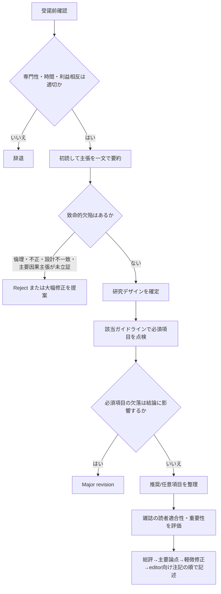

# 学術論文査読ガイドライン総覧

## エグゼクティブサマリー

本報告の結論は明確です。**良い査読は、雑誌適合性の判断、研究デザイン固有の報告基準の点検、内部妥当性と解釈の妥当性の評価を、別々にしかし統合して行う作業**です。トップジャーナルの公開基準を比較すると、いずれも「新規性」「妥当性」「重要性」「明瞭性」「倫理性」を重視しますが、**Nature と Science は分野横断的インパクト、The Lancet・NEJM・JAMA は臨床的重要性、BMJ は読者への実用性と報告完全性**をより前面に出しています。 citeturn17view0turn16search1turn15search1turn18search2turn8view3turn6view5

研究デザイン別に見ると、**RCT には CONSORT 2025、観察研究には STROBE、診断精度研究には STARD、系統的レビューには PRISMA 2020、質的研究には SRQR/COREQ、動物研究には ARRIVE 2.0、ケースレポートには CARE、パイロット試験には CONSORT pilot extension、混合方法研究には GRAMMS**を主軸に据えるのが最も再現性の高い実務です。方法論論文と in vitro 研究は単一の普遍標準が相対的に弱く、**主題別に COSMIN、GRRAS、SAMPL、MDAR などを当てる「マッピング型査読」**が実務的です。 citeturn20search1turn11search21turn11search3turn11search2turn12search7turn12search6turn12search2turn12search20turn13search0turn26search7turn14search18turn14search21turn14search4turn30search1

重要なのは、**報告ガイドラインは「研究の質そのもの」を保証するものではなく、「読むために必要な情報が揃っているか」を点検する道具**だという点です。したがって、査読では報告ガイドラインに加えて、必要に応じて **RoB 2（ランダム化試験のバイアスリスク評価ツール）**、**ROBINS-I（非ランダム化介入研究のバイアスリスク評価ツール）**、**AMSTAR 2（系統的レビューの批判的吟味ツール）**、**QUADAS-2（診断精度研究の質評価ツール）**などを補助的に使うと、コメントの質が大きく上がります。 citeturn24search4turn24search5turn23search4turn33search0

また、査読者への単純な「報告基準項目のリマインド」だけでは、出版後論文の報告完全性は有意に改善しなかったというランダム化試験があります。つまり、**実務で効くのは、チェック項目を羅列することではなく、優先順位づけされた具体的な修正要求を書くこと**です。本報告の汎用チェックリストとフレーズ集は、そのための実用テンプレートとして設計しています。 citeturn22search0turn22search6

## 査読の設計原理と情報源

本報告では、主として entity["organization","EQUATOR Network","reporting guideline network"] の公式ライブラリ、各誌の査読者向けページ・著者向けページ、原著ガイドライン論文、ならびに必要に応じて entity["organization","Cochrane","evidence synthesis network"] 系のバイアス評価ツールを用いて整理しました。報告ガイドラインは、研究の「書き方」を透明化する最低基準であり、トップジャーナルの査読基準は、それに加えて「その雑誌に載せる価値があるか」を判断する編集的基準を含みます。したがって、査読の実務では、**報告完全性・方法論の健全性・雑誌適合性**の三層で読むのが妥当です。 citeturn20search3turn11search18turn11search21turn12search7turn24search3turn6view5turn8view3turn17view0

実務上の最小原則は次の三つです。第一に、**研究質問と研究デザインが対応しているか**を先に見ること。第二に、**主要結果を支える最小限の方法情報が示されているか**を、そのデザインの公式ガイドラインで確認すること。第三に、**不足情報が「報告不備」なのか「設計欠陥」なのかを区別して書くこと**です。前者は通常 revision で是正可能ですが、後者はしばしば major revision でも埋まらず、reject 相当になります。これは BMJ と JAMA の査読者向け指示、Nature の referee report の考え方、Science の objective evaluation の原則と整合的です。 citeturn8view3turn6view5turn17view0turn16search1

## 研究デザイン別ガイドラインと査読ポイント

以下の表は、各研究デザインについて、**優先して参照すべき公式ガイドライン**と、査読での主要論点を **必須・推奨・任意**に分けて再構成したものです。一次ソースは原著ステートメント、公式サイト、公式ライブラリを優先し、必要に応じて補助的な批判的吟味ツールを併記しました。 citeturn20search1turn11search21turn11search3turn11search2turn12search7turn12search6turn12search2turn12search20turn13search0turn26search7turn14search18turn14search21turn14search4turn30search1

**臨床試験（RCT）**  
主軸は **CONSORT 2025（Consolidated Standards of Reporting Trials；ランダム化比較試験報告基準）** で、クラスター化、クロスオーバー、有害事象、非劣性などは relevant extension を確認するのが原則です。査読での補助としては **RoB 2** が有用です。 citeturn20search1turn20search2turn20search12turn24search4turn24search26

| 参照ガイドライン | 必須 | 推奨 | 任意 | 典型的な査読コメント例 | 改善提案 |
|---|---|---|---|---|---|
| CONSORT 2025、必要に応じて関連 extension、補助として RoB 2 | 無作為化方法、割付隠蔽、主要評価項目の事前規定、解析集団、参加者フロー、登録番号、試験プロトコル/統計解析計画、害（有害事象）、欠測の扱い | 介入内容の再現可能な説明、サブグループ解析の事前性、臨床的に意味のある効果量と信頼区間、共介入・逸脱の記述 | 探索的機序解析、補足感度分析の追加図表 | 「主要評価項目の定義と測定時点は明記されていますが、割付隠蔽と欠測値処理の説明が不足しており、内的妥当性を評価できません。」 | 方法に random sequence generation・allocation concealment・missing data handling を追記し、CONSORT フローチャートと protocol/SAP への参照を本文で明確化する |

**観察研究（コホート、ケースコントロール、横断）**  
主軸は **STROBE（Strengthening the Reporting of Observational Studies in Epidemiology；観察研究報告基準）** です。観察研究は「報告の抜け」よりも「交絡、選択バイアス、測定バイアス」の説明不足が致命傷になりやすいため、介入研究なら **ROBINS-I**、曝露研究なら **ROBINS-E** の発想を補助的に借りると査読が安定します。 citeturn11search21turn11search1turn11search25turn24search5turn24search1

| 参照ガイドライン | 必須 | 推奨 | 任意 | 典型的な査読コメント例 | 改善提案 |
|---|---|---|---|---|---|
| STROBE（コホート） | 研究対象の選定、曝露と転帰の定義、追跡期間・脱落、交絡因子と調整戦略、欠測の扱い | 感度分析、逆因果や time-varying bias への言及、absolute risk の提示 | 追加のサブグループ図 | 「追跡脱落と欠測の扱いが不十分で、推定値の頑健性を判断しにくいです。」 | フローチャート、欠測率、追跡喪失理由、主要推定値の感度分析を追加する |
| STROBE（ケースコントロール） | 症例・対照の定義と選定源、マッチング基準、曝露測定法、交絡調整、選択バイアスの可能性 | 測定者盲検、 recall bias への対策、 source population の説明 | 補足層別解析 | 「対照群の選定根拠が不明確で、症例群との比較可能性に懸念があります。」 | 対照選定の母集団、除外基準、マッチングの理由と解析方法を明示する |
| STROBE（横断） | 標本抽出枠、調査時点、主要変数定義、回答率、重みづけの有無、交絡調整 | 非回答バイアス評価、測定妥当性、感度分析 | 補足表での記述統計拡充 | 「回答率と非回答者特性が示されておらず、代表性の判断が困難です。」 | サンプリング方法、回答率、非回答比較、重みづけや補正の有無を追記する |

**診断精度研究**  
主軸は **STARD 2015（Standards for Reporting Diagnostic Accuracy Studies；診断精度研究報告基準）** です。比較診断研究なら、補助的に **QUADAS-2** や comparative study 用の **QUADAS-C** のドメイン発想を使うと、患者選択・index test・reference standard・flow/timing を整理しやすくなります。 citeturn11search3turn11search11turn33search0turn33search4turn33search5

| 参照ガイドライン | 必須 | 推奨 | 任意 | 典型的な査読コメント例 | 改善提案 |
|---|---|---|---|---|---|
| STARD 2015、必要に応じて QUADAS-2 / QUADAS-C の観点 | 参加者スペクトラム、index test と reference standard の定義、閾値の事前性、盲検、flow and timing、2×2 表または診断精度推定値と信頼区間 | 臨床使用場面の明示、閾値選定の根拠、決定曲線や calibration の補足 | exploratory cutoff の補助表 | 「閾値が事後的に最適化されたように見え、汎化可能性とバイアスの評価が難しいです。」 | training/validation の分離、閾値の事前規定または探索的である旨の明記、フローダイアグラム追加 |

**系統的レビュー／メタ解析**  
主軸は **PRISMA 2020（Preferred Reporting Items for Systematic Reviews and Meta-Analyses；系統的レビュー報告基準）** です。報告チェックに加え、査読では **AMSTAR 2** と **ROBIS** を使って方法論的弱点を見つけると有効です。含まれた一次研究のバイアス評価には、RCT なら RoB 2、非ランダム化介入研究なら ROBINS-I が標準です。 citeturn11search2turn11search6turn11search26turn23search0turn23search7turn24search4turn24search5

| 参照ガイドライン | 必須 | 推奨 | 任意 | 典型的な査読コメント例 | 改善提案 |
|---|---|---|---|---|---|
| PRISMA 2020、補助として AMSTAR 2 / ROBIS | 明確な review question、登録/プロトコル、再現可能な検索式、選択過程、データ抽出法、バイアス評価、統合手法、異質性・小規模研究バイアス、エビデンス certainty | gray literature の扱い、重複レビューア、感度分析、 publication bias の解釈 | 補足検索や updated search の追記 | 「検索戦略が再現できず、レビューの包括性を検証できません。」 | 全データベースの完全検索式、日付、除外理由、PRISMA flow diagram、 risk-of-bias summary を追加する |

**質的研究**  
インタビューやフォーカスグループ中心なら **COREQ（Consolidated Criteria for Reporting Qualitative Research）**、より広い質的研究全般には **SRQR（Standards for Reporting Qualitative Research）** が主軸です。質的研究の査読では、手法名のラベル自体より、**研究者の立ち位置、サンプリング、分析過程、解釈の根拠づけ**が重要です。 citeturn12search6turn12search0turn12search7turn12search1

| 参照ガイドライン | 必須 | 推奨 | 任意 | 典型的な査読コメント例 | 改善提案 |
|---|---|---|---|---|---|
| SRQR、インタビュー/FGD では COREQ | 研究パラダイムと方法選択理由、研究者 reflexivity、サンプリング戦略、データ収集状況、分析手順、引用例、解釈の根拠 | saturation / information power の説明、監査証跡、複数分析者、参加者確認 | 追加引用、補足表でコード例 | 「テーマは興味深いですが、分析がどのように生成されたのかが十分に追跡できません。」 | コーディング手順、研究者の関与、テーマ生成の過程、代表的引用と反例を追記する |

**基礎研究（in vivo / in vitro）**  
in vivo 動物研究の主軸は **ARRIVE 2.0（Animal Research: Reporting of In Vivo Experiments）** で、**Essential 10** と **Recommended Set** に分かれます。in vitro 研究は単一の普遍標準が弱いため、**MDAR（Materials Design Analysis Reporting；材料・設計・解析・報告の透明性枠組み）** を基盤に、実験系固有の基準を補うのが実務的です。 citeturn12search2turn12search13turn30search0turn30search1

| 参照ガイドライン | 必須 | 推奨 | 任意 | 典型的な査読コメント例 | 改善提案 |
|---|---|---|---|---|---|
| ARRIVE 2.0（in vivo） | 研究デザイン、サンプルサイズ根拠、除外基準、無作為化、盲検、主要アウトカム、統計手法、動物情報、手技、主要結果 | housing/husbandry、倫理、プロトコル逸脱、一般化可能性 | 補足図表の拡充 | 「ランダム化・盲検・除外基準の記載がなく、バイアス抑制策が判定できません。」 | ARRIVE Essential 10 に対応する記述を Methods に明示し、除外と protocol deviation を結果に追記する |
| MDAR（in vitro） | 試薬・細胞・材料の同定可能性、対照条件、独立反復と技術反復の区別、解析手順、データ/コード/材料の可用性、統計の透明性 | バッチ差や実験日の影響、再現性検証、材料制限の開示 | exploratory assay の補足 | 「反復の単位と統計単位が曖昧で、結果の再現性評価が難しいです。」 | biological replicate と technical replicate を区別し、材料可用性・解析コード・生データへのアクセス方法を明記する |

**方法論論文**  
方法論論文には単一の普遍標準がないため、**論文の主題でガイドラインを当て分ける**のが原則です。尺度・患者報告アウトカム測定法なら **COSMIN**、信頼性・一致性なら **GRRAS**、統計報告中心なら **SAMPL**、ライフサイエンスの一般的透明性は **MDAR**、予測モデルなら TRIPOD / TRIPOD+AI が適切です。 citeturn14search18turn14search6turn14search21turn14search1turn14search4turn14search12turn30search1turn25search4turn25search1

| 参照ガイドライン | 必須 | 推奨 | 任意 | 典型的な査読コメント例 | 改善提案 |
|---|---|---|---|---|---|
| COSMIN / GRRAS / SAMPL / MDAR を主題別適用 | 方法の目的、既存法との差分、検証デザイン、外部妥当性、再現可能なアルゴリズム・式・コード、統計選択の妥当性 | 外部検証、 calibration や agreement 指標、利用場面と限界の明示 | 補足ソフトウェアやチュートリアル | 「提案手法の新規性は示されていますが、既存法との比較と独立データでの妥当性検証が不十分です。」 | comparator を追加し、再現用コード、事前仕様、外部検証またはブートストラップ検証を示す |

**ケースレポート**  
主軸は **CARE（CAse REport）ガイドライン** です。ケースレポートは因果推論の強さが限定的であるため、査読では「珍しい」ことよりも、**時間軸、臨床推論、介入、転帰、一般化できる教訓**が明確かを見ます。 citeturn12search20turn12search3turn12search32

| 参照ガイドライン | 必須 | 推奨 | 任意 | 典型的な査読コメント例 | 改善提案 |
|---|---|---|---|---|---|
| CARE | 患者情報、時系列、診断評価、介入、転帰・追跡、患者同意 | 鑑別診断、臨床的含意、限界 | 患者視点の補足 | 「時系列が断片的で、どの介入がどの転帰に対応するかが分かりにくいです。」 | CARE の timeline を追加し、診断過程と follow-up を整理して記載する |

**予備研究（pilot / feasibility）**  
主軸は **CONSORT extension for randomised pilot and feasibility trials** です。ここで最も重要なのは、**“有効性を証明した” と言わず、将来の本試験の実施可能性を評価した** と位置づけることです。 citeturn13search0turn13search4turn13search3

| 参照ガイドライン | 必須 | 推奨 | 任意 | 典型的な査読コメント例 | 改善提案 |
|---|---|---|---|---|---|
| CONSORT pilot extension | feasibility 目的、進行基準、募集・保持・遵守・受容性、サンプルサイズ根拠、将来本試験への含意 | 予備的効果推定の慎重な提示、手続き上の問題点、 protocol modification | exploratory clinical outcome の参考提示 | 「本研究は feasibility 試験としては有用ですが、本文の結論が有効性確証に踏み込み過ぎています。」 | 目的と結論を feasibility 中心に修正し、 progression criteria と本試験への修正案を明記する |

**混合方法研究**  
主軸は **GRAMMS（Good Reporting of A Mixed Methods Study）** で、研究計画や査読補助としては entity["organization","NIH","us biomedical funder"] の mixed methods best practices が有用です。混合方法研究の査読では、質的・量的それぞれの厳密さに加え、**“なぜ混ぜたのか、どこで混ぜたのか、混ぜることで何が増えたのか”** を必ず問うべきです。 citeturn26search7turn31view3turn26search14

| 参照ガイドライン | 必須 | 推奨 | 任意 | 典型的な査読コメント例 | 改善提案 |
|---|---|---|---|---|---|
| GRAMMS、補助として NIH mixed methods best practices | 混合の正当化、デザインの種類・優先性・順序、各方法のサンプリング/収集/分析、統合の時点と方法、 meta-inference、混合に伴う限界 | joint display、統合担当者・プロセスの明示、相補/不一致の解釈 | 追加の統合図表 | 「量的結果と質的結果は並列に示されていますが、統合の方法と統合から得られた洞察が明確ではありません。」 | joint display を追加し、統合の目的・手順・統合から得られた新知見を discussion に明示する |

## トップジャーナルの共通点と差異

トップジャーナルの公開資料を比較すると、共通する核は **妥当性、独創性、重要性、明瞭性、倫理性、建設的コメント**です。ただし、どの価値を最上位に置くかは雑誌で異なります。以下の比較は、各誌の公開 reviewer guidance、editorial policy、author instructions のうち公表されている部分に基づく要約です。NEJM と The Lancet は reviewer page の公開粒度が他誌より限定的であるため、必要に応じて official public policy や editorial process の説明も併用しました。 citeturn17view0turn16search1turn15search0turn18search2turn8view3turn6view5

| ジャーナル | 公開基準から読み取れる重点 | 査読モデル・透明性 | 査読コメント作成への含意 |
|---|---|---|---|
| Nature | **original scientific research、outstanding scientific importance、interdisciplinary readership への関心**。referee には「誰が関心を持つか」と「技術的欠陥」を明示することが求められる。 citeturn17view0 | 透明化 peer review を選択可能。editor が広い読者への関心を判断し、reviewer は主に technical failings を詰める。 citeturn17view0 | 総評冒頭で「何が新しいか」と「どの点がまだ立証されていないか」を一文で切り分けるのが有効です。 |
| Science | **objective assessment、constructive and timely comments、reviewer anonymity、confidentiality** が前面。personal comments は排除される。 citeturn16search1turn16search0turn18search0 | 匿名査読。レビューは客観的・礼節的であることが明示される。 citeturn18search0turn10search1 | 強い否定を書く場合でも、人格ではなく証拠と方法に限定して書くべきです。 |
| The Lancet | **peer review は不確実性と限界を明確化し、研究を available evidence の totality に置く**。ランダム化試験・観察研究・メタ解析に各報告基準を要求。 citeturn15search1turn27search0turn27search1turn27search2 | reviewer comments は authors 向けコメントと editor 向け confidential comments に分ける。公開ポリシーでは匿名性が基本。 citeturn10search0turn15search0 | 「この研究単独で何を言えるか」よりも、「既存エビデンス全体の中で主張がどう位置づくか」を必ず書くと相性が良いです。 |
| NEJM | **scientific accuracy、novelty、importance** に加え、editorial・peer・statistical review を強調。novelty or importance が乏しければ外部査読前に不採択となりうる。 citeturn18search2turn18search3turn18search6turn15search10 | 公開される reviewer 指示は限定的だが、NEJM Group 公開資料では conflicts disclosure と外部 peer review、統計レビューの重視が示される。 citeturn10search2turn15search14turn28search2 | コメントは「科学的に正しいか」に加え、「NEJM 級の重要性があるか」を分けて記述した方が編集判断に資します。 |
| BMJ | **validity、quality、originality** に加え、**一般読者（clinicians, researchers, policymakers, educators, patients）にとっての重要性**と、報告チェックリスト・プロトコルとの整合を明示的に問う。 citeturn8view3 | fully open peer review。reviewer 名を著者に開示し、報告は署名が原則。 citeturn21search1turn21search0 | 書きぶりはより説明責任が高くなります。断定より「理由つきの評価」と「修正可能な提案」が重要です。 |
| JAMA | reviewer form が非常に構造化されており、**Quality、Priority、Material Original、Data Valid、Conclusions Reasonable、Information Important、Writing Clear、General Medical Interest、reporting guideline adherence** を系統的に問う。editor は **Novelty、Validity、Impact、Audience** を強調。 citeturn6view5turn29search0 | single-anonymized。AI 使用は confidentiality を侵さない範囲でのみ許容し、使用開示が必要。 citeturn6view5turn29search2 | 査読コメントもこの順に並べると通りが良いです。つまり「新規性→妥当性→影響→読者適合→修正優先順位」の順で書くのが最も実務的です。 |

要するに、**Nature/Science は「大きな前進か」、The Lancet/NEJM/JAMA は「臨床・科学的に重要で信頼できるか」、BMJ は「読者の意思決定を助けるほど明瞭で完全か」**に重心があります。ただし、どの雑誌でも methods が結論を支えていなければ通らない、という点は共通です。 citeturn17view0turn16search1turn15search1turn18search2turn8view3turn6view5

## 汎用査読チェックリストと作成手順

以下のフローチャートは、上記のジャーナル基準と代表的報告ガイドラインを統合した、**雑誌横断で使える査読判断フロー**です。受諾前確認、致命的欠陥の切り分け、デザイン別チェック、雑誌適合性、修正優先順位の順で進めると、コメントが短くても精度が上がります。 citeturn6view5turn8view3turn17view0turn16search1turn20search1turn11search21turn11search2

### 短縮版チェックリスト

この短縮版は、**どの雑誌でも最低限見るべき 12 項目**です。Yes/No ではなく、**充足・不十分だが修正可能・結論に影響する欠陥**の三段階で付けると実務的です。 citeturn6view5turn8view3turn17view0turn16search1

| 項目 | 見るポイント | 判定の目安 |
|---|---|---|
| 研究質問の明確性 | PICO, PECO,目的、仮説が明確か | 曖昧なら major |
| 研究デザイン適合性 | 質問に対して design が妥当か | 不一致は fatal に近い |
| 主要方法の透明性 | ランダム化、サンプリング、検索、分析手順等 | 欠落が結論に触れるなら major |
| バイアス抑制策 | 無作為化、盲検、交絡調整、事前登録等 | 不十分なら major |
| 統計/解析妥当性 | 推定量、CI、欠測、感度分析、前提 | 誤用は major/fatal |
| 結果の完全性 | 主要結果、フロー、除外、害、有害事象 | 選択報告の疑いは重大 |
| 結論の節度 | データが支える範囲に留まるか | 過大主張は major |
| 新規性 | 何が既存研究に追加されるか | 乏しければ優先度低 |
| 重要性 | 読者・臨床・政策・理論への意味 | 雑誌適合性に直結 |
| 倫理・透明性 | 倫理承認、同意、COI、資金、データ共有 | 欠落は必ず指摘 |
| 報告ガイドライン充足 | デザイン別 checklist と整合するか | 不一致は具体的に指摘 |
| 可読性 | 構成、図表、用語、再現可能性 | minor になりやすい |

### 詳細版チェックリスト

詳細版は、**編集者がそのまま decision letter に転用しやすい論点順**に並べています。JAMA の reviewer form の構造と、BMJ/Nature の general principles を折衷した形です。 citeturn6view5turn8view3turn17view0

| 領域 | 詳細チェック | 赤旗 |
|---|---|---|
| 総評 | 論文の主張を 2–3 文で要約できるか | 要約不能なほど論旨不明 |
| 新規性 | 既報との差分が introduction/discussion に示されるか | “初めて” の根拠がない |
| 優先度 | その雑誌の読者にとって重要か | 良い研究でも journal fit が弱い |
| デザイン | 研究質問に design が整合するか | 因果主張に不適切 design |
| サンプル | 選定方法、対象の代表性、サイズ根拠 | convenience sample を一般化 |
| 介入/曝露/収集 | 再現可能な詳細があるか | 手続きが曖昧 |
| 比較対照 | 対照群・比較条件が妥当か | comparator 不適切 |
| 主要アウトカム | 事前規定・定義・時点が明確か | outcome switching の疑い |
| 統計 | 効果量、CI、多重性、欠測、感度分析 | p 値偏重、解析単位不明 |
| バイアス | confounding、selection、measurement、publication bias への対処 | 限界節が表面的 |
| 結果提示 | フロー、表、図、補足資料が必要十分か | 分母不明、図表が本文と不整合 |
| 解釈 | 因果主張・一般化・臨床含意が節度あるか | overinterpretation |
| 透明性 | 登録、プロトコル、SAP、データ/コード、材料可用性 | 「available on request」のみで実質不透明 |
| 倫理 | IRB、同意、動物倫理、患者同意、画像匿名化 | 倫理情報の欠落 |
| COI/資金 | 利益相反・資金源・役割の記載 | sponsor role が不明 |
| 報告基準 | 該当 checklist と本文が合っているか | checklist が形式提出だけ |
| 文体 | 読みやすさ、抄録整合、図表凡例 | 抄録が本文を正確に反映しない |
| 最終勧告 | 直せば成立するのか、土台が弱いのか | 判定理由が曖昧 |

### トップジャーナル基準に合わせた推奨コメント作成手順

**第一段階は、冒頭 3–5 行の総評を書くこと**です。「本稿は何を問うたか」「主な長所」「主要な懸念」を先に置きます。JAMA は reviewer に summary comment と strengths/weaknesses を求め、Nature は “who will be interested and why / technical failings” を理想的 report としています。 citeturn6view5turn17view0

**第二段階は、“報告不備” と “設計欠陥” を分けること**です。前者は「追記してください」、後者は「このままでは結論を支持できません」と書くべきで、同じ tone にしない方が編集判断に有用です。BMJ は validity と completeness を、Science は objective assessment を明示しており、この区別が実務的に重要です。 citeturn8view3turn16search1

**第三段階は、デザイン別ガイドラインに沿って major points を 2–5 個に限定すること**です。コメント数を増やすほど良いわけではありません。特に RCT、系統的レビュー、混合方法研究では、主要な欠落点を優先順位づけして示さないと、著者も編集者も動けません。 citeturn20search1turn11search2turn26search7

**第四段階は、journal fit を別段落で書くこと**です。「研究として妥当だが当誌の読者への重要性は限定的」といったコメントは、Nature/NEJM/JAMA では特に重要です。方法論的欠陥と雑誌適合性を混同しない方が、decision の質が上がります。 citeturn17view0turn18search2turn6view5

**第五段階は、著者向けコメントと editor 向け confidential comment を分けること**です。The Lancet は両者の分離を明示し、JAMA でも editor decisions は reviewer が下すものではないとされています。著者向けには改善可能性を、editor 向けには優先度・致命傷・統計査読要否を書きます。 citeturn10search0turn6view5

**第六段階は、具体的な修正文書や必要データを指名すること**です。たとえば「Methods に allocation concealment を 2–3 文追記」「Supplement に完全検索式を追加」「flow diagram を挿入」などです。単なる checklist reminder は出版後完全性を十分に改善しなかったため、**行動可能な要求に言い換える**ことが大切です。 citeturn22search0turn22search6

## 実務上の注意点と推奨フレーズ集

実務では、**査読の目的は著者に勝つことではなく、編集判断を助け、必要なら論文を改善させること**です。BMJ と Science は礼節と建設性を、JAMA は respectful and constructive comments を、Nature は technical failings を満たすことを重視しています。したがって、人格評価、動機推定、断定的な言い切りは避け、**根拠→懸念→改善可能な提案**の順で書くのが最も安定します。 citeturn8view3turn16search0turn6view5turn17view0

また、AI 支援の扱いには注意が必要です。JAMA は、**査読対象原稿や抄録、査読文自体を chatbot や language model に入力することは confidentiality agreement に反する**と明示しています。Science や BMJ の confidential / anonymity 原則とも整合的です。したがって、要約や翻訳支援を使う場合でも、**原稿本文を外部 AI に投入しない**のが安全です。 citeturn6view5turn29search2turn18search0turn8view3

### 推奨フレーズ集

**総評の書き出し**

- 「本稿は、［研究課題］に対して［研究デザイン］で取り組んでおり、主張の核は［一文要約］と理解しました。」  
- 「臨床的／学術的に重要な問いを扱っており、特に［強み］は評価できます。」  
- 「一方で、現時点では［主要懸念］が結論の解釈を制約しています。」

**major revision を求めるとき**

- 「この点は追記だけでなく、解析の妥当性そのものに関わるため、主要な修正事項と考えます。」  
- 「現行の記述ではバイアスの程度を判断できず、主結果の信頼性評価が困難です。」  
- 「結論を維持するには、少なくとも［追加解析／追加説明］が必要です。」

**minor revision を求めるとき**

- 「主張の方向性は理解できますが、読者が再現・解釈するために以下の明確化が必要です。」  
- 「本文の結論は概ね支持されますが、報告の透明性を高めるため［具体項目］の追記を推奨します。」  
- 「これは主結果を覆す懸念ではありませんが、理解可能性を高める重要な修正です。」

**overclaim を和らげて指摘するとき**

- 「本データから支持されるのは関連／予備的示唆までであり、因果的・確証的表現は控えた方が適切です。」  
- 「効果の存在を示唆する結果ではありますが、試験規模／設計上の制約から、結論はより慎重に記述すべきです。」  
- 「discussion の一部は結果から踏み出し過ぎているため、解釈の範囲を本文に合わせて調整してください。」

**雑誌適合性を伝えるとき**

- 「研究としては丁寧ですが、本誌読者に対する広い重要性は現稿からは十分に示されていません。」  
- 「技術的には堅実でも、当誌の想定読者にとっての新規性／インパクトの説明が弱い印象です。」  
- 「もし当誌掲載を想定するなら、既存文献との差分と読者便益をより明確に示す必要があります。」

**editor 向け confidential comment の例**

- 「主懸念は［統計／交絡／選択バイアス］で、追加説明で解消し得る部分と、設計上解消困難な部分が混在しています。」  
- 「統計査読が有益と思われます。特に［多重性、欠測、モデル化］の扱いを専門的に確認いただきたいです。」  
- 「研究課題は重要ですが、現稿の journal fit は中程度以下と考えます。」

**reject 相当のときでも建設的に書く例**

- 「現稿の中心主張は魅力的ですが、主要推定値を支える方法情報が欠けており、現時点では妥当性を確認できません。」  
- 「追加説明では埋まらない設計上の制約があるため、本誌での採択は難しいと考えます。」  
- 「著者にとって有益と思われる点として、次稿では少なくとも［具体項目］を事前に設計へ組み込むことを推奨します。」

## 限界

本報告は、原則として公式ガイドライン原文と公式ページに依拠しましたが、**NEJM と The Lancet の reviewer 向け公開情報は他誌より粒度が不均一**で、一部は public editorial policy や author guidance を併用して補いました。また、**混合方法研究と in vitro 研究、方法論論文には単一の普遍標準が相対的に弱い領域**があり、その部分では一つのチェックリストに還元するより、複数の主題別ガイドラインを重ねる方が正確です。したがって、最終的な実務では「デザインの大分類」だけでなく、「その論文の主張が何を売りにしているか」で補助ガイドラインを追加する運用が最も堅実です。 citeturn18search2turn15search0turn26search7turn31view3turn30search1turn14search18turn14search21turn14search4